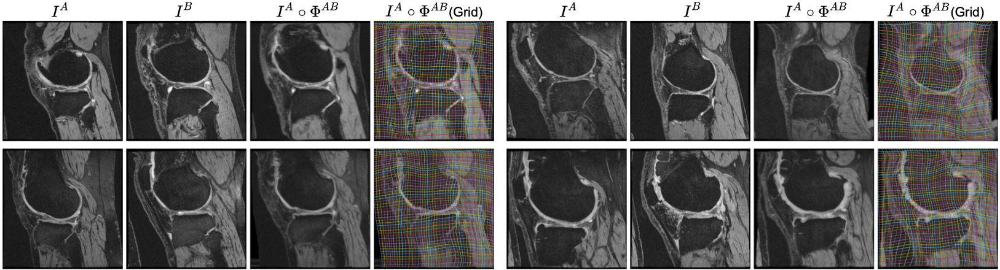

# ICON: Learning Regular Maps through Inverse Consistency

[](https://github.com/uncbiag/ICON/actions)



This is the official repository for  

**ICON: Learning Regular Maps through Inverse Consistency.**   
Hastings Greer, Roland Kwitt, Francois-Xavier Vialard, Marc Niethammer.  
_ICCV 2021_ https://arxiv.org/abs/2105.04459

## Cite this work
```
@InProceedings{Greer_2021_ICCV,
    author    = {Greer, Hastings and Kwitt, Roland and Vialard, Francois-Xavier and Niethammer, Marc},
    title     = {ICON: Learning Regular Maps Through Inverse Consistency},
    booktitle = {Proceedings of the IEEE/CVF International Conference on Computer Vision (ICCV)},
    month     = {October},
    year      = {2021},
    pages     = {3396-3405}
}
```

## Video Presentation

[](https://youtu.be/7kZsJ3zWDCA)


## Running our code

We are available on PyPI!
```
pip install icon-registration
````

To run our pretrained model in the cloud on 4 sample image pairs from OAI knees (as above), visit [our google colab notebook](https://colab.research.google.com/drive/1Pd3ua_NZTem3xtBvDxertzi7u3E233ZL?usp=sharing)

----------------

To train from scratch on the synthetic triangles and circles dataset:

```
git clone https://github.com/uncbiag/ICON
cd ICON

python setup.py install -e

python training_scripts/2d_triangles_example.py
```


