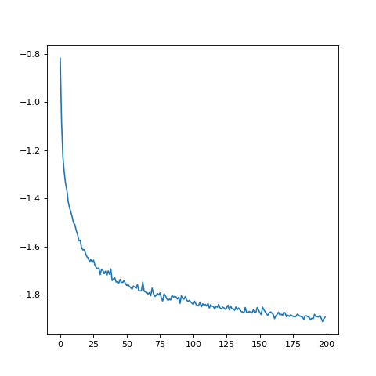
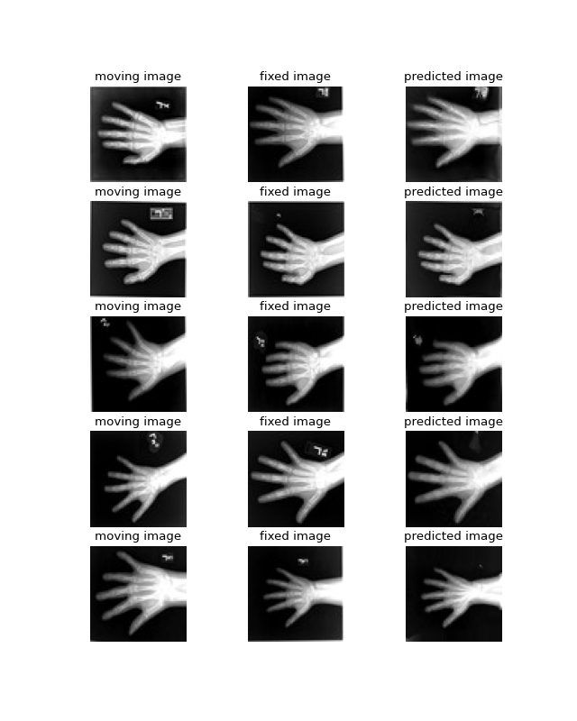

ICON and MONAI
==============

Loosely based on `This MONAI notebook demonstrating registration <https://github.com/Project-MONAI/tutorials/blob/main/2d_registration/registration_mednist.ipynb>`_ 

Using MONAI U-Nets in ICON
^^^^^^^^^^^^^^^^^^^^^^^^^^

MONAI and ICON are already almost compatible in this regard. The differences are that

- ICON expects U-Nets to take two images as inputs, while MONAI U-Nets take one image. 
- ICON U-Nets come with the last layer initialized to weights and biases of zero so that training starts at the identity map, for most MONAI U-Nets this needs to be done manually (RegUNet comes with an argument for this)

.. plot::
   :include-source:
   :context:

   import monai
   import icon_registration as icon
   from icon_registration.config import device
   import icon_registration.monai_wrapper
   import torch

   monai_deformable_net = icon.FunctionFromVectorField(
    icon_registration.monai_wrapper.ConcatInputs(
       monai.networks.nets.AttentionUnet(
             2, 2, 2, channels=[16, 32, 64, 128, 256], strides=(2, 2, 2, 2, 2))))
   
   
   
   torch.nn.init.zeros_(monai_deformable_net.net.net.model[2].conv.weight)
   torch.nn.init.zeros_(monai_deformable_net.net.net.model[2].conv.bias)

This can be mixed and matched with other ICON registration modules in a registration pipeline

.. plot::
    :include-source:
    :context:

    import icon_registration.networks

    inner_net = icon.TwoStepRegistration(
        icon.TwoStepRegistration(
            icon.FunctionFromMatrix(
                icon_registration.networks.ConvolutionalMatrixNet(dimension=2)),
            icon.FunctionFromMatrix(
                icon_registration.networks.ConvolutionalMatrixNet(dimension=2)),
        ),
        monai_deformable_net
    )
Using MONAI similarity metrics in ICON
^^^^^^^^^^^^^^^^^^^^^^^^^^^^^^^^^^^^^^

ICON losses assume that the first channel is intensity, and the second channel in the warped image indicates whether the value is interpolated or extrapolated. MONAI doesn't use this convention, so we strip the second channel.

.. plot::
    :include-source:
    :context:
    :nofigs:

    model = icon.GradientICON(
       inner_net,
       icon_registration.monai_wrapper.FirstChannelInputs(
           monai.losses.GlobalMutualInformationLoss(),
       ),
       .7
    )

    model.assign_identity_map([1, 1, 64, 64])
    model.to(device)
    model.train()

    optimizer = torch.optim.Adam(model.parameters(), 1e-3)

Using an ICON RegistrationModule with MONAI
^^^^^^^^^^^^^^^^^^^^^^^^^^^^^^^^^^^^^^^^^^^

First, let's load a MONAI dataset

.. plot::
    :include-source:
    :context:
       
    from monai.utils import first
    from monai.transforms import (
        EnsureChannelFirstD,
        Compose,
        LoadImageD,
        ScaleIntensityRanged,
    )
    from monai.data import DataLoader, Dataset, CacheDataset
    from monai.networks.blocks import Warp
    from monai.apps import MedNISTDataset
    import os
    import tempfile

    max_epochs = 200
    root_dir = tempfile.mkdtemp()
    train_data = MedNISTDataset(root_dir=root_dir, section="training", download=True, transform=None)
    training_datadict = [
        item
        for item in train_data.data if item["label"] == 4  # label 4 is for xray hands
    ]
    train_transforms = Compose(
        [
            LoadImageD(keys=["image"]),
            EnsureChannelFirstD(keys=["image"]),
            ScaleIntensityRanged(keys=["image"],
                                 a_min=0., a_max=255., b_min=0.0, b_max=1.0, clip=True,),
        ]
    )
    check_ds = Dataset(data=training_datadict, transform=train_transforms)
    check_loader = DataLoader(check_ds, batch_size=1, shuffle=True)
    check_data = first(check_loader)
    fixed_image = check_data["image"][0][0]

    plt.figure("check", (6, 6))
    plt.title("fixed_image")
    plt.imshow(fixed_image, cmap="gray")

Next, we train our hybrid model using the MONAI idiom

.. plot::
   :context:
   :nofigs:

   max_epochs=1

   import os
   if "READTHEDOCS" in os.environ:
       del model

.. plot::
   :context:
   :include-source:

   train_ds = CacheDataset(data=training_datadict[:1000], transform=train_transforms,
                       cache_rate=1.0, num_workers=4)
   train_loader_fixed = DataLoader(train_ds, batch_size=16, shuffle=True, num_workers=2)
   train_loader_moving = DataLoader(train_ds, batch_size=16, shuffle=True, num_workers=2)

   epoch_loss_values = []

   for epoch in range(max_epochs):
       model.train()
       epoch_loss, step = 0, 0
       for fixed, moving in zip(train_loader_fixed,train_loader_moving):
           step += 1
           optimizer.zero_grad()

           moving = moving["image"].to(device)
           fixed = fixed["image"].to(device)
           loss_obj = model(moving, fixed)
           loss = loss_obj.all_loss
           loss.backward()
           optimizer.step()
           epoch_loss += loss.item()

       epoch_loss /= step
       epoch_loss_values.append(epoch_loss)
   plt.close()
   plt.plot(epoch_loss_values)

.. 
    :context:
    :include-source:

    import torchvision
    def show(tensor):
        plt.imshow(torchvision.utils.make_grid(tensor[:6], nrow=3)[0].cpu().detach(), cmap="gray")
        plt.xticks([])
        plt.yticks([])
    image_A = moving
    image_B = fixed
    plt.subplot(2, 2, 1)
    show(image_A)
    plt.subplot(2, 2, 2)
    show(image_B)
    plt.subplot(2, 2, 3)
    show(model.warped_image_A)
    plt.contour(torchvision.utils.make_grid(model.phi_AB_vectorfield[:6], nrow=3)[0].cpu().detach())
    plt.contour(torchvision.utils.make_grid(model.phi_AB_vectorfield[:6], nrow=3)[1].cpu().detach())
    plt.subplot(2, 2, 4)
    show(model.warped_image_A - image_B)
    plt.tight_layout()

Finally, let's visualize some registrations! To call an ICON module on two images (or batches of images) and get back a ddf (deformation field) compatible with :mod:`monai`'s Warp layer, use :func:`icon_registration.monai_wrapper.make_ddf_using_icon_module`. Alternatively, if you have an ICON style transform already and want to convert it to a :mod:`monai` ddf, use :func:`icon_registration.monai_wrapper.make_ddf_from_icon_transform`.

.. plot:: 
   :nofigs:
   :context:

   plt.close()

.. plot::
    :include-source:
    :context:

    warp_layer = Warp("bilinear", "border").to(device)
    val_ds = CacheDataset(data=training_datadict[2000:2500], transform=train_transforms,
                          cache_rate=1.0, num_workers=0)
    val_loader_fixed = DataLoader(val_ds, batch_size=16, num_workers=0)
    val_loader_moving = DataLoader(val_ds, batch_size=16, num_workers=0)
    for fixed, moving in zip(train_loader_fixed,train_loader_moving):
        moving = moving["image"].to(device)
        fixed = fixed["image"].to(device)
        ddf, loss = icon_registration.monai_wrapper.make_ddf_using_icon_module(
            model,
            moving, 
            fixed)
        pred_image = warp_layer(moving, ddf)
        break

    fixed_image = fixed.detach().cpu().numpy()[:, 0]
    moving_image = moving.detach().cpu().numpy()[:, 0]
    pred_image = pred_image.detach().cpu().numpy()[:, 0]
    batch_size = 5
    plt.subplots(batch_size, 3, figsize=(8, 10))
    for b in range(batch_size):
        # moving image
        plt.subplot(batch_size, 3, b * 3 + 1)
        plt.axis('off')
        plt.title("moving image")
        plt.imshow(moving_image[b], cmap="gray")
        # fixed image
        plt.subplot(batch_size, 3, b * 3 + 2)
        plt.axis('off')
        plt.title("fixed image")
        plt.imshow(fixed_image[b], cmap="gray")
        # warped moving
        plt.subplot(batch_size, 3, b * 3 + 3)
        plt.axis('off')
        plt.title("predicted image")
        plt.imshow(pred_image[b], cmap="gray")
    plt.axis('off')

